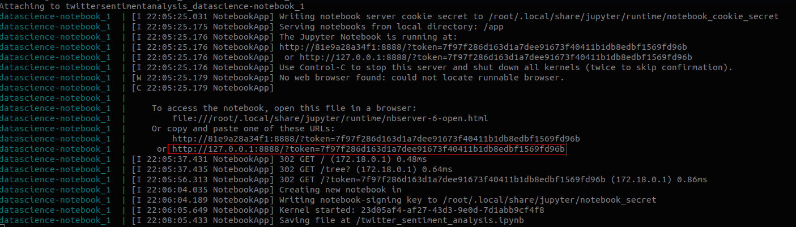

# VaiDarLike
Projeto que prevê o sucesso ou o insucesso do seu vídeo no YouTube

### Como executar

Pré-requisitos: [Docker](https://docs.docker.com/).

**Primeiro passo**: Inicie o container (Isso pode demorar um pouco). _Pode necessitar de permissões de administrador para executar este comando_.  
`$ docker-compose up`  
ou  
`$ sudo docker-compose up`

**Segundo passo**: Após inicialização do container, uma mensagem de log aparecerá.  

**Terceiro passo**: Copie a mensagem de log similar a destacada na imagem e cole-a em seu navegador de preferência. _Esse link em específico é necessário devido ao token que o jupyter notebook requere em sua inicialização_

**Quarto passo**: Acesse o arquivo `.ipynb` no jupyter notebook dashboard.

**Quinto passo**: Navegue até a opção _cell_ e escolha a opção _"Run All"_. **O notebook pode demorar um pouco para executar todos os algoritmos**

Caso queira parar o container, apenas pressione Ctrl + C e espere.